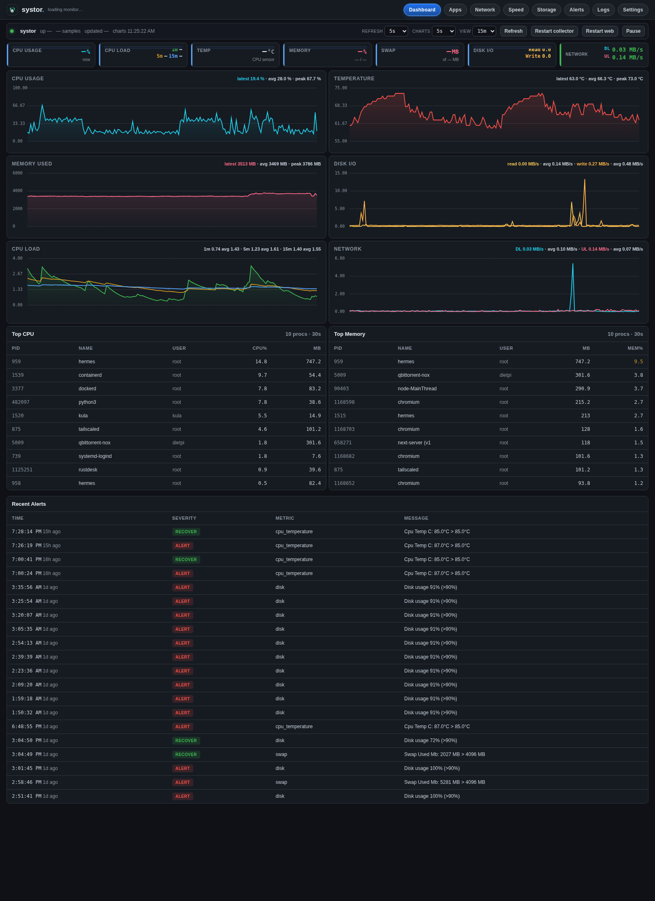
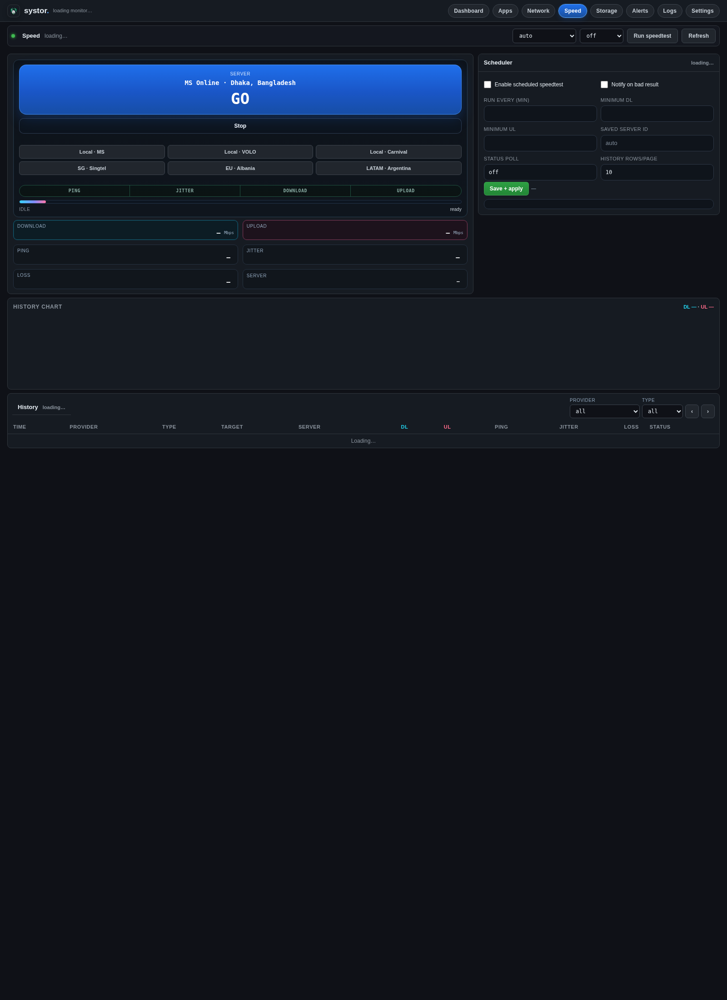

<p align="center">
  
</p>

<h1 align="center">systor</h1>

<p align="center">
  Lightweight Linux system monitor with a branded web dashboard, sustained-threshold alerts, storage browser, process views, and Telegram/Discord notifications.
</p>

<p align="center">
  <a href="https://github.com/SeaXen/systor/releases/tag/v0.1.0"></a>
  <a href="https://github.com/SeaXen/systor/blob/main/LICENSE"></a>
  
  <a href="https://systor.xuup.top/"></a>
  <a href="https://seaxen.github.io/systor/"></a>
  
</p>

---

## What it is

`systor` is a small self-hosted monitoring app for Linux boxes where Prometheus + Grafana is too heavy and terminal-only tools are too limited.

It is built for:
- DietPi / Raspberry Pi / small home servers
- low-RAM VPS machines
- personal infrastructure where you want a **fast dashboard**, **real alerts**, and **simple operations**

It runs as two long-lived processes:
- **collector** — samples system metrics and writes them to SQLite
- **web** — serves the dashboard and admin UI on port `6677`

No Docker required. No JS framework. No Prometheus. No Grafana. No external database.

---

## Screenshots

### Dashboard



### Speed test



---

## Highlights

- **Live dashboard** — CPU, temperature, memory, swap, disk I/O, CPU load, network DL/UL, chart history, top processes, recent alerts
- **Apps page** — host + Docker processes ranked by CPU, RAM, network, and disk activity
- **Network page** — live traffic + daily / monthly / yearly usage views with interface filtering
- **Speed page** — official Ookla CLI runs, saved server selection, scheduler, run history, packet loss, and alert thresholds
- **Storage page** — browser for allowed roots, uploads/downloads, chunk uploads, checksums, duplicate scan, trash/restore, action-password support
- **Telegram + Discord notifications** — channel-specific test/send flows from the UI
- **Systemd-managed** — `systor-web` and `systor-collector` install as boot services
- **Lightweight** — simple Python app, SQLite storage, static assets only

---

## Public vs private access model

`systor` supports a practical split between **public viewing** and **private admin access**.

### Public / internet
When accessed from a non-private address, `systor` can be exposed as a **read-only dashboard**:
- dashboard visible
- admin pages hidden
- restart/settings/storage/admin APIs blocked
- no sensitive controls on the public UI

### LAN / localhost / Tailscale
Private access keeps the full surface:
- Settings
- Speed runner
- Apps / Network / Storage pages
- Restart controls
- notification configuration
- admin APIs

That makes it reasonable to publish a public dashboard through a Cloudflare tunnel while keeping admin operations local.

---

## Why not just use Grafana?

| Tool | RAM / complexity | Strength | Trade-off |
|---|---:|---|---|
| Prometheus + Grafana | high | powerful ecosystem | heavy for small boxes |
| Netdata | medium-high | instant charts | more surface than many people need |
| Glances web | low | quick install | limited UI / workflow depth |
| **systor** | **low** | focused, branded, practical | intentionally narrower scope |

If you want a small, direct, all-in-one monitor for one machine or a few machines, `systor` is the point.

---

## Quick start

```bash
git clone https://github.com/SeaXen/systor.git
cd systor
sudo ./install.sh
```

Then open:
- local: <http://127.0.0.1:6677>
- LAN: `http://<host-ip>:6677`

Default bind:
- host: `0.0.0.0`
- port: `6677`

The installer:
- copies the app to `/opt/systor`
- writes config to `/etc/systor/config.yaml`
- writes secrets env file to `/etc/systor/systor.env`
- installs Python dependencies from `requirements.txt`
- installs and enables `systor-web.service` and `systor-collector.service`
- creates `/var/log/systor/` and `/var/lib/systor/`

---

## Requirements

- Linux
- Python `3.9+`
- `systemd`
- `pip3`

Optional but useful:
- `speedtest` (official Ookla CLI) for WAN tests
- `docker` if you want Docker process visibility
- `tailscale` if you use private overlay access
- `cloudflared` if you want a public tunnel

---

## Services

| Service | Purpose | Default |
|---|---|---|
| `systor-collector` | metric sampling + alert evaluation | enabled on boot |
| `systor-web` | dashboard and admin UI | enabled on boot |

Useful commands:

```bash
systemctl status systor-web
systemctl status systor-collector
systemctl restart systor-web
systemctl restart systor-collector
```

---

## Configuration

Main config:
- `/etc/systor/config.yaml`

Secrets env file:
- `/etc/systor/systor.env`

Example env file:

```bash
SYSTOR_TELEGRAM_BOT_TOKEN=...
SYSTOR_TELEGRAM_CHAT_ID=...
SYSTOR_DISCORD_WEBHOOK=...
```

Config can be adjusted through the **Settings** page for normal operation.

---

## Pages

| Page | URL | Purpose |
|---|---|---|
| Dashboard | `/` | KPI strip, charts, top processes, recent alerts |
| Apps | `/apps` | host + Docker app/process usage |
| Network | `/network` | live traffic and usage rollups |
| Speed | `/speed` | speedtest runner, scheduler, history |
| Storage | `/storage` | file manager for allowed roots |
| Alerts | `/alerts` | recent alert log |
| Logs | `/logs` | log view / clear / download |
| Settings | `/settings` | thresholds, defaults, channels, runtime controls |

---

## Speed page

The Speed page is a real runner, not a fake animation.

It supports:
- **official Ookla CLI** runs
- saved server selection
- local quick-pick buttons
- scheduler / auto-run
- run history with provider / target / DL / UL / ping / jitter / loss / status
- alerting on bad speed results

If `speedtest` is missing:

```bash
curl -s https://packagecloud.io/install/repositories/ookla/speedtest-cli/script.deb.sh | sudo bash
sudo apt-get install speedtest
```

---

## Storage page

The Storage page is designed for practical server-side file work rather than full desktop-style browsing.

Current capabilities include:
- allowed-root browsing
- uploads and chunk uploads
- downloads
- copy / move / rename / delete / trash / restore
- checksum and duplicate scan
- optional action password for destructive operations
- LAN/Tailscale-only write protection

This is intentionally conservative for safety.

---

## Notifications

Telegram and Discord are first-class features.

You can:
- save credentials from the UI
- send live test notifications
- route alerts through one or both channels
- review recent delivery results

Message formatting is different per channel so alerts stay readable.

---

## Releases and changelog

- First public release: **v0.1.0**
- Human-readable change history: [`CHANGELOG.md`](CHANGELOG.md)
- GitHub releases: use the Releases tab for tagged snapshots and release notes

---

## API

The front-end consumes JSON endpoints under `/api/`.

Common endpoints:
- `GET /api/snapshot`
- `GET /api/runtime`
- `GET /api/series?metric=cpu_pct&hours=6`
- `GET /api/network-series?hours=6`
- `GET /api/apps?scope=all&sort=cpu&limit=24`
- `GET /api/top-processes?by=cpu&n=10`
- `GET /api/public-dashboard?hours=6`
- `GET /api/alerts?limit=50`
- `POST /api/restart-collector`
- `POST /api/restart-web`
- `GET /health`

Public mode intentionally exposes only a small read-only subset.

---

## Project layout

```text
systor/
├── systor/
│   ├── cli.py
│   ├── collector.py
│   ├── config.py
│   ├── metrics.py
│   ├── notifier.py
│   ├── speed.py
│   ├── storage.py
│   ├── web.py
│   ├── static/
│   └── templates/
├── systemd/
├── docs/
├── install.sh
├── requirements.txt
├── setup.py
└── README.md
```

---

## Troubleshooting

### Dashboard not reachable on LAN

```bash
ss -ltnp | grep 6677
systemctl status systor-web
```

### Notifications not arriving
- verify credentials in Settings
- use **Save + test** from the UI
- inspect `/var/log/systor/`

### `speedtest` not found
Install the official Ookla CLI and ensure it is on `PATH`.

### Docker app data missing
The collector runs as root by default. If you run custom service users, Docker access may need adjustment.

### I changed host or port
Update config, then restart the web service:

```bash
systemctl restart systor-web
```

---

## Security notes

- keep secrets in `/etc/systor/systor.env`, not in git
- do not expose admin pages directly to the public internet
- prefer LAN / Tailscale for admin access
- if using Cloudflare tunnel, expose the read-only dashboard surface only
- limit Storage roots to the minimum you actually need

---

## GitHub Pages landing

A static marketing page lives in [`docs/`](docs/) (`index.html` + `landing.css`). Enable it once in the repo:

**Settings → Pages → Build from branch `main` → folder `/docs`**

Public URL: **https://seaxen.github.io/systor/** (after GitHub finishes the first deploy).

---

## License

MIT.

---

## Author

**Dr. Sagar**  
GitHub: [SeaXen](https://github.com/SeaXen)  
Email: [drpelagik@gmail.com](mailto:drpelagik@gmail.com)
